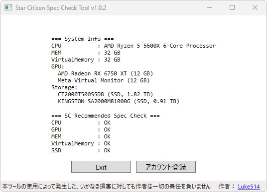

# これは何をするためのもの？
作者の考えたStar Citizenを出来るだけ快適に遊ぶことのできる推奨スペックをチェックするツールです  
(判定は少し厳しめです)
  
判定基準などは以下の記事をご覧ください  
https://lukesplaygrounds.com/2024/11/05/recommended-pc-specs-for-star-citizen/  
  
  
  
Star Citizenのアカウント登録や、購入方法は以下の記事をご覧ください  
https://lukesplaygrounds.com/2024/04/07/how-to-start-star-citizen/  
  
# ツールの入手と起動
1.&nbsp;[Releases](https://github.com/Luke-514/StarCitizen_Spec_Check_Tool/releases/latest)からツールのZIPファイル(StarCitizen_Spec_Check_Tool.zip)をダウンロードします  
  
2.&nbsp;任意の場所でZIPファイルを展開し、StarCitizen_Spec_Check_Tool.exeを起動してください  
&emsp;(展開したフォルダ内にあるファイルはツールの動作に必要ですので、削除しないよう気を付けてください)  
&emsp;  
  
# 利用上の注意
> [!CAUTION]  
> ・あくまでも作者が考えた推奨スペックに適合するかのチェックツールです  
> &emsp;一部がNGでも、遊ぶことのできるPCは沢山ありますので、参考程度にご利用ください
>   
> ・SCプレイヤーが利用しているPCスペックは[公式テレメトリー](https://robertsspaceindustries.com/telemetry)をご覧ください  
  
# よくある質問
Q.&nbsp;ツールを起動するとWindows Defenderに止められる  
A.&nbsp;詳細情報を押すと出てくる実行ボタンを押してください  
&emsp;
  
  
Q.&nbsp;同じGPUが複数回出力される  
A.&nbsp;複数のディスプレイを接続していると、その数だけ出力されます  
&emsp;トラブルシューティングに使用するため、仕様として残しています  
  
# 利用規約
許可  
・個人利用  
・SNSや動画、ブログでの紹介  
&emsp;(掲載連絡は不要ですが、当ページのリンクを貼ってください)  
  
禁止  
・商用利用  
・二次配布  
・逆コンパイル、コードの抽出  
  
# 免責事項
本ツールの使用によって発生した、いかなる損害に対しても作者は一切の責任を負いません。  
Star Citizen®、Roberts Space Industries®、Cloud Imperium®はCloud Imperium Rights LLCの登録商標です。  
  
# 作者
Luke514  
  
Twitter  
@rx_luke  
  
Star Citizen紹介コード(referral code)  
STAR-9YPT-ZV5J  
  
# Special Thanks
SEAGANG  
Someone  
Ugachain  
aritu  
ぽえな  
あしま  
[Star Citizen Japan Community](http://discord.gg/Wa99tKE48e)  
  
# 寄付

